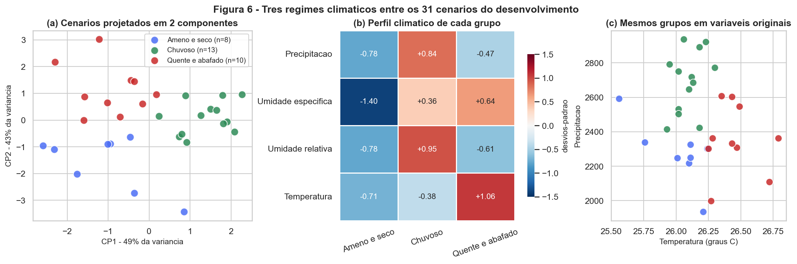
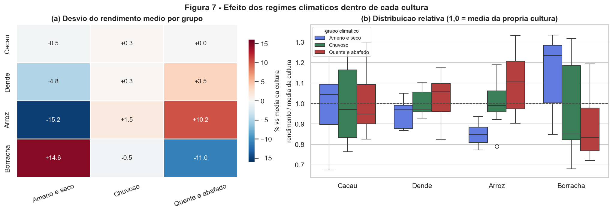
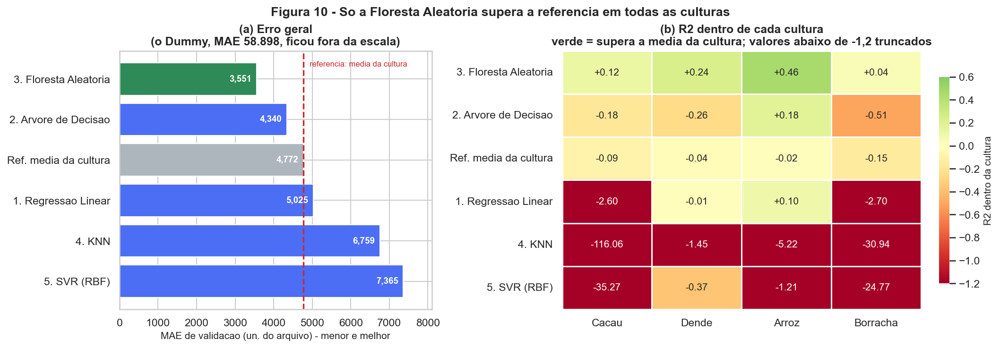

# FarmTech Solutions — Fase 5

**Previsão de rendimento de safra com Machine Learning e estimativa de custos em nuvem AWS**

Projeto do PBL da Fase 5 — FIAP, curso de Inteligência Artificial.
Uma fazenda de médio porte (200 hectares) produz quatro culturas. A partir de dados de clima e
rendimento, o trabalho explora tendências por clusterização, investiga cenários discrepantes e
compara cinco algoritmos de regressão para prever a produtividade.

> ### 🚧 Estado do projeto: em desenvolvimento
> A Entrega 1 (Machine Learning) está em **primeira versão completa e executada**. A Entrega 2
> (AWS), os protótipos do "Ir Além" e os quatro vídeos **ainda não foram desenvolvidos**.
> As pendências estão marcadas com `⏳ PENDENTE` ao longo deste README e detalhadas em
> [`docs/CONTINUIDADE_EQUIPE.md`](docs/CONTINUIDADE_EQUIPE.md).

---

## Sumário

- [Equipe](#equipe)
- [Entrega 1 — Machine Learning](#entrega-1--machine-learning)
- [Entrega 2 — Computação em nuvem (AWS)](#entrega-2--computação-em-nuvem-aws)
- [Ir Além](#ir-além)
- [Vídeos](#vídeos)
- [Instalação e execução](#instalação-e-execução)
- [Estrutura do repositório](#estrutura-do-repositório)
- [Pendências](#pendências)

---

## Equipe

| Integrante | Nome completo | RM |
| --- | --- | --- |
| Coordenador | ⏳ *pendente* | ⏳ *pendente* |
| Larissa | ⏳ *pendente* | ⏳ *pendente* |
| Elton | ⏳ *pendente* | ⏳ *pendente* |
| Matheus | ⏳ *pendente* | ⏳ *pendente* |

> ⏳ **PENDENTE:** nomes completos e RMs. A divisão de responsabilidades entre as frentes de
> trabalho (ML, IoT/simulação, AWS/documentação) ainda será definida pelo grupo.

---

## Entrega 1 — Machine Learning

### 👉 [Abrir o notebook: `notebooks/farmtech_desenvolvimento.ipynb`](notebooks/farmtech_desenvolvimento.ipynb)

O notebook contém a solução completa, executada, com todas as saídas preservadas: análise
exploratória, clusterização, investigação de outliers e a comparação dos cinco regressores. **Toda
a descrição detalhada da solução está lá** — este README apenas conduz o leitor até ele.

> ⏳ **PENDENTE:** o enunciado exige que o arquivo se chame `NomeCompleto_rmXXXXX_pbl_fase4.ipynb`.
> A renomeação depende dos nomes e RMs.

### A base de dados

`data/crop_yield.csv` — 156 registros, 6 colunas, preservado sem alterações
(SHA-256 `07B3335F...F771B1B`).

| Coluna | Descrição |
| --- | --- |
| `Crop` | Cultura: *Cocoa, beans* · *Oil palm fruit* · *Rice, paddy* · *Rubber, natural* (39 registros cada) |
| `Precipitation (mm day-1)` | Precipitação |
| `Specific Humidity at 2 Meters (g/kg)` | Umidade específica a 2 m |
| `Relative Humidity at 2 Meters (%)` | Umidade relativa a 2 m |
| `Temperature at 2 Meters (C)` | Temperatura a 2 m |
| `Yield` | **Alvo** — rendimento da safra |

### Três decisões que definem o trabalho

**1. A base tem 156 linhas, mas só 39 observações climáticas independentes.**
Cada combinação das quatro variáveis climáticas aparece exatamente quatro vezes, uma por cultura.
Não são duplicatas — os rendimentos diferem porque as culturas diferem. Mas, para avaliar
generalização, cada cenário climático precisa ficar **inteiro** em treino ou em teste. Uma divisão
aleatória comum deixaria o modelo ver no treino exatamente o clima do teste.

**2. A cultura sozinha explica 98,8% da variação do rendimento.**
Uma referência que apenas prevê a média da cultura, ignorando o clima por completo, já atinge
R² = 0,987. Por isso o R² global não serve para comparar os modelos aqui, e toda a avaliação é feita
**dentro de cada cultura**, contra essa referência.

**3. As unidades declaradas não batem com os valores.**
O enunciado diz que `Yield` está em t/ha, mas os valores vão de 5.249 a 203.399 — 200 mil t/ha é
agronomicamente impossível. Os dados **não foram convertidos**: as métricas são reportadas na
unidade original do arquivo, acompanhadas do erro percentual, que independe da unidade.
⏳ **PENDENTE:** confirmar as unidades com a FIAP.

O protocolo completo está em [`docs/CONTRATO_DADOS.md`](docs/CONTRATO_DADOS.md).

### Principais resultados

**Três regimes climáticos** foram identificados entre os cenários (K-Means sobre os cenários únicos,
sem usar o rendimento). O número de grupos foi escolhido por **estabilidade sob reamostragem**
(ARI 0,92), não pelo maior valor de silhueta — e não é quatro:

| Regime | Cenários | Perfil |
| --- | --- | --- |
| Chuvoso | 13 | Maior precipitação e umidade relativa |
| Quente e abafado | 10 | Maior temperatura e umidade específica |
| Ameno e seco | 8 | Menor temperatura e umidade específica |



**O efeito do clima existe, mas só em duas das quatro culturas — e em sentidos opostos.**
O arroz rende +10,2% no regime quente e −15,2% no ameno; a borracha faz o inverso (−11,0% e +14,6%).
Cacau e dendê praticamente não respondem.



**Comparação dos cinco algoritmos** (previsões de validação, `GroupKFold` de 5 partições):

| Alternativa | MAE | RMSE | R² | MAPE |
| --- | --- | --- | --- | --- |
| **3. Floresta Aleatória** | **3.551** | 6.651 | 0,991 | 11,0% |
| 2. Árvore de Decisão | 4.340 | 8.506 | 0,985 | 13,0% |
| *Ref. média da cultura* | *4.772* | *7.846* | *0,987* | *14,2%* |
| 1. Regressão Linear | 5.025 | 7.915 | 0,987 | 19,5% |
| 4. KNN | 6.759 | 15.723 | 0,948 | 35,4% |
| 5. SVR (RBF) | 7.365 | 11.001 | 0,975 | 39,6% |
| *Ref. média global (Dummy)* | *58.898* | *69.146* | *−0,000* | *340,8%* |

*MAE e RMSE em unidades de rendimento do arquivo — ver a dúvida de unidades acima.*

**A Floresta Aleatória é a única alternativa que supera a referência da média da cultura nas quatro
culturas.** Regressão linear, KNN e SVR ficaram piores do que simplesmente prever a média da
cultura — algo que o R² global de 0,95 a 0,99 esconde completamente.



> ⏳ **PENDENTE:** a avaliação no conjunto de teste reservado (32 linhas, 8 cenários) **não foi
> executada**. Ela acontece uma única vez, após a revisão da equipe e o fechamento da escolha do
> modelo. Nenhum resultado acima vem do teste.

---

## Entrega 2 — Computação em nuvem (AWS)

> ### ⏳ PENDENTE — não iniciada
>
> Esta seção comparará o custo de uma máquina Linux On-Demand (100%) entre **São Paulo
> (`sa-east-1`)** e **Norte da Virgínia (`us-east-1`)**, com a configuração exigida pelo enunciado:
>
> | Requisito | Valor |
> | --- | --- |
> | CPUs | 2 |
> | Memória | 1 GiB |
> | Rede | até 5 Gbps |
> | Armazenamento | 50 GB |
>
> **O que ainda precisa ser produzido:** cotação nas duas regiões pela calculadora oficial da AWS,
> capturas de tela, tabela comparativa de custos e a justificativa técnica considerando acesso
> rápido aos dados e a restrição legal de armazenamento no exterior.
>
> Nenhum preço, link ou captura foi incluído neste repositório, porque nenhum foi obtido ainda.
> Instruções detalhadas em [`docs/CONTINUIDADE_EQUIPE.md`](docs/CONTINUIDADE_EQUIPE.md) e o
> checklist em [`docs/aws/README.md`](docs/aws/README.md).

---

## Ir Além

> ### ⚠️ Aviso obrigatório sobre o escopo dos extras
>
> **Este projeto apresenta um protótipo com ESP32 e sensores simulados no Wokwi. O grupo não
> dispunha de hardware físico. Os testes demonstram o funcionamento do software e da comunicação
> implementada; não constituem coleta física nem validação agronômica. Os requisitos de ESP32 real
> e coleta física do enunciado permanecem não atendidos.**
>
> O enunciado admite avaliar extras incompletos, mas a forma de avaliação dessa simulação ainda não
> foi confirmada com a FIAP. Os extras não valem nota nas entregas obrigatórias.

### Ir Além 1 — Coleta e comunicação com ESP32

> ⏳ **PENDENTE — não iniciado.** Arquitetura e contrato de mensagens especificados em
> [`ir_alem/README.md`](ir_alem/README.md).

Arquitetura planejada:

```
ESP32 virtual (Wokwi) + 2 sensores virtuais distintos
        ↓  Wi-Fi simulado
   Broker MQTT público na internet
        ↓
 Assinante Python no computador  →  CSV / SQLite  →  visualização
```

O gateway público do Wokwi permite conexões de saída à internet, mas **não** acessa a rede local do
computador — por isso a comunicação passa por um broker MQTT, e não por HTTP direto ao `localhost`.

### Ir Além 2 — Classificação de saúde da plantação

> ⏳ **PENDENTE — não iniciado.** Depende do Ir Além 1.

Classificador "Saudável" / "Não saudável" treinado com **base simulada própria**, gerada pelo
protótipo. Restrições registradas:

- Os rótulos **não** derivam do rendimento do `crop_yield.csv` — são problemas distintos.
- Se os rótulos vierem de regras artificiais, as métricas medem apenas se o modelo **reproduz a
  regra**, não se ele diagnostica plantas.
- Treino e validação separados **por sessão simulada**.

---

## Vídeos

Quatro vídeos de até 5 minutos, publicados como **não listados** no YouTube.

| # | Vídeo | Link | Situação |
| --- | --- | --- | --- |
| 1 | Entrega 1 — Machine Learning | ⏳ *pendente* | Depende do fechamento do teste final |
| 2 | Entrega 2 — Comparação AWS | ⏳ *pendente* | Depende da cotação |
| 3 | Ir Além 1 — Coleta e comunicação | ⏳ *pendente* | Depende do protótipo |
| 4 | Ir Além 2 — Classificação de saúde | ⏳ *pendente* | Depende do classificador |

> ⏳ **PENDENTE:** nenhum vídeo foi gravado. Os links serão inseridos quando existirem — nenhuma URL
> foi inventada aqui.

---

## Instalação e execução

Ambiente testado em **Windows 11 com Python 3.12.10**, em 06/09/2026.

```powershell
# 1. Clonar e entrar na pasta do projeto
git clone <url-do-repositorio>
cd fase5-cap1-farmtech

# 2. Criar o ambiente virtual
python -m venv .venv

# 3. Ativar
.\.venv\Scripts\Activate.ps1

# 4. Instalar as dependências nas versões testadas
python -m pip install --upgrade pip
python -m pip install -r requirements.txt

# 5. Abrir o notebook
jupyter lab notebooks\farmtech_desenvolvimento.ipynb
```

No Jupyter, use **Kernel → Restart Kernel and Run All Cells** para executar do zero.
Tempo aproximado: **cerca de 1 minuto**.

Para executar sem abrir a interface:

```powershell
.\.venv\Scripts\python.exe -m jupyter nbconvert --to notebook --execute --inplace notebooks\farmtech_desenvolvimento.ipynb
```

> Se o PowerShell bloquear a ativação do ambiente, rode uma vez na sessão:
> `Set-ExecutionPolicy -Scope Process -ExecutionPolicy Bypass`

O notebook localiza a raiz do projeto sozinho e usa apenas caminhos relativos, então funciona tanto
executado de `notebooks/` quanto da raiz.

---

## Estrutura do repositório

```text
fase5-cap1-farmtech/
├── README.md                          # este arquivo
├── PLANEJAMENTO.md                    # cronograma e acordos do grupo
├── requirements.txt                   # versões efetivamente testadas
├── .gitignore
│
├── data/
│   └── crop_yield.csv                 # base original, preservada e verificada por hash
│
├── notebooks/
│   └── farmtech_desenvolvimento.ipynb # ⭐ Entrega 1, executado com as saídas salvas
│
├── docs/
│   ├── CONTRATO_DADOS.md              # protocolo de dados e avaliação (leitura obrigatória)
│   ├── CONTINUIDADE_EQUIPE.md         # tarefas por frente de trabalho
│   ├── GUIA_APRESENTACAO.md           # roteiro para apresentar o projeto ao grupo
│   ├── AJUSTE_IR_ALEM_SIMULADO.md     # mudança de escopo dos extras
│   ├── ENUNCIADO.md                   # cópia do enunciado
│   ├── protocolo_divisao.json         # divisão exata, gerada pelo notebook
│   ├── resultados_modelos.csv         # métricas exportadas pelo notebook
│   ├── figuras/                       # 12 figuras geradas na execução
│   └── aws/                           # ⏳ estimativas e capturas (pendente)
│
└── ir_alem/
    └── README.md                      # arquitetura e contrato de mensagens (pendente)
```

---

## Pendências

Organizadas por frente. Os responsáveis serão definidos pelo grupo.

| Frente | Pendência |
| --- | --- |
| **Coordenação** | Confirmar unidades de `Yield` e `Precipitation` com a FIAP |
| **Coordenação** | Reunir nomes completos e RMs; renomear o notebook |
| **Coordenação** | Criar e publicar o repositório remoto público |
| **ML** | Revisar a seção 8 e fechar a escolha do modelo |
| **ML** | Executar a seção 9 (teste reservado) uma única vez |
| **ML** | Classificador demonstrativo do Ir Além 2 |
| **IoT / simulação** | Circuito Wokwi com dois sensores virtuais distintos |
| **IoT / simulação** | Firmware com Wi-Fi e publicação MQTT |
| **IoT / simulação** | Receptor Python e registro das sessões |
| **AWS / documentação** | Cotação nas duas regiões, com capturas |
| **AWS / documentação** | Justificativa técnica e consolidação do README |
| **Vídeos** | Gravar e publicar os quatro vídeos |

Detalhamento, critérios de pronto e dependências em
[`docs/CONTINUIDADE_EQUIPE.md`](docs/CONTINUIDADE_EQUIPE.md).

---

### Requisitos do enunciado ainda **não atendidos**

Registrados de forma explícita, para não haver dúvida:

- ❌ **ESP32 real** — o grupo não dispõe do hardware; o protótipo será simulado no Wokwi.
- ❌ **Coleta física de dados por sensores** — os dados dos extras serão simulados.
- ❌ **Validação agronômica da saúde das plantas** — não há observação real de plantas.

Esses itens dizem respeito apenas às entregas extras ("Ir Além"), que não valem nota.
**As duas entregas obrigatórias seguem com escopo completo.**
